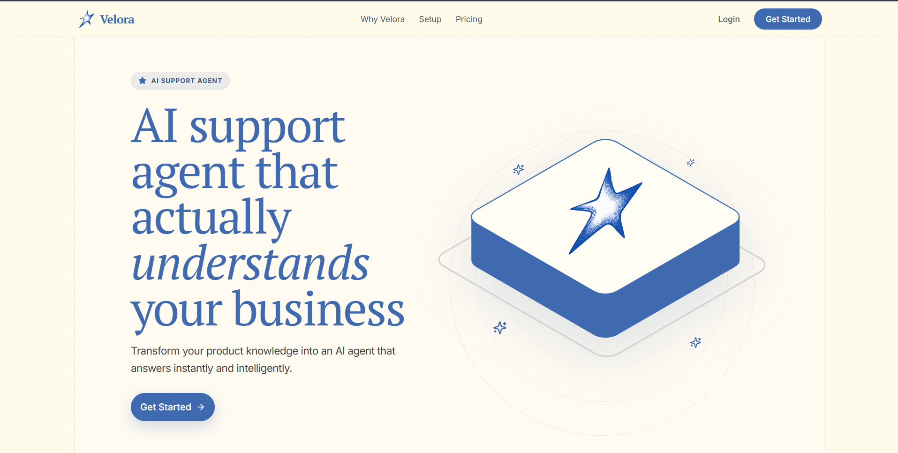

#  Velora

[](https://velora.10xshivam.dev) [](https://youtu.be/baSL9e6Nb-Q) [](https://github.com/10xshivam/Velora) [](https://github.com/10xshivam/Velora/forks) [](https://github.com/10xshivam/Velora/issues) [](https://github.com/10xshivam/Velora/blob/main/LICENSE)

> AI Agent that actually understands your business

## What is Velora

Velora is a production-ready AI support agent that deeply understands your business context, documentation, and product knowledge. Built for modern SaaS companies, it transforms static resources into an interactive widget that remembers customer conversations, handles intelligent responses in real-time, and integrates seamlessly into your existing workflows without requiring complex AI infrastructure.



## Features
- **Flexible Integrations & AI Chat Widget**: Deploy an embeddable, responsive customer support widget across websites and apps (HTML, React, Next.js) with real-time streaming responses.
- **Product-Trained Knowledge**: Train Velora on your website, docs, and FAQs. Automatically vectorize and ingest business documents via Firecrawl and Jina to deliver accurate, business-aligned responses.
- **Context-Aware Support**: LangGraph-powered conversational memory maintains context across messages and follow-ups so users don't have to repeat themselves.
- **Customer Context Extraction**: Access customer details like email, device, location, and session data directly within conversations for highly personalized AI responses.
- **AI + Human Workflow**: Automatically resolve routine queries or smoothly escalate them, giving your support team full control directly from a unified dashboard inbox.
- **Support Analytics**: Track requests, resolutions, escalations, and trends with real-time insights to continuously improve your support performance.
- **Workspace Administration**: Comprehensive admin controls to manage agent settings, appearance, knowledge bases, and secure authentication (JWT & Google OAuth).
- **Subscription & Billing**: Built-in pricing, billing tiers, and usage gating via Dodo Payments.
- **Developer-First Architecture**: Clean monorepo structure (Turborepo) featuring containerized Docker services for rapid deployment and robust local development.

## Tech Stack

| Category | Technologies |
|---|---|
| **Frontend** | Next.js 16 (App Router), React 19, TailwindCSS, shadcn/ui, Zustand, Framer Motion |
| **Backend** | Node.js, Express, LangChain, LangGraph, Qdrant |
| **Database** | PostgreSQL (Neon DB), Prisma ORM |
| **AI Integration** | Gemini API, Jina AI |
| **DevOps** | Docker, Docker Compose, Turborepo |
| **Tooling** | TypeScript, ESLint, Prettier, PNPM |

## Project Structure

```text
velora/
├── apps/
│   ├── web/               # Next.js workspace dashboard for ops teams
│   └── widget/            # Next.js embeddable customer chat widget
├── packages/
│   ├── backend/           # Node.js/Express API and LangGraph AI agent
│   ├── db/                # Prisma schema, migrations, and database client
│   ├── eslint-config/     # Shared ESLint configurations
│   ├── typescript-config/ # Shared TypeScript configurations
│   └── ui/                # Shared React components (shadcn/ui)
├── docker/                # Dockerfiles for web, widget, and backend
└── docker-compose.yml     # Local deployment and orchestration
```

## Getting Started

### Prerequisites
- Node.js >= 20
- PNPM >= 10.x
- Docker (optional, but recommended)

### Option A: Run with Docker (Recommended)
The fastest way to spin up the entire stack (Database, Backend, Web, Widget).

```bash
pnpm run docker:dev
```
This automatically starts:
- Next.js Web Dashboard (`localhost:3000`)
- Next.js Embeddable Widget (`localhost:3001`)
- Node.js API Backend (`localhost:8080`)
- Syncs local file changes to containers in real-time.

### Option B: Run Manually
If you prefer running services directly via Turborepo:

```bash
pnpm install
pnpm build
pnpm dev
```

## Environment Variables
Environment templates are provided in each application and package. Duplicate the `.env.example` files to `.env` and fill in your keys.

| Location | Purpose | Key Variables |
|---|---|---|
| `apps/web/.env` | Next.js Dashboard | `NEXT_PUBLIC_API_BASE_URL`, `NEXT_PUBLIC_GOOGLE_CLIENT_ID`, `RESEND_API_KEY` |
| `apps/widget/.env` | Next.js Widget | `NEXT_PUBLIC_API_BASE_URL` |
| `packages/backend/.env` | API & AI Agent | `DATABASE_URL`, `QDRANT_URL`, `GOOGLE_API_KEY`, `GROQ_API_KEY`, `JWT_SECRET`, `DODO_API_KEY` |
| `packages/db/.env` | Prisma ORM | `DATABASE_URL` |

## Prisma Database Management
Manage your PostgreSQL database from the root directory using PNPM filters.

```bash
# Generate the Prisma client after schema changes
pnpm dlx turbo run db:generate

# Apply pending migrations to the database
pnpm dlx turbo run db:migrate

```

## Scripts
Core commands available from the root `package.json`.

| Command | Description |
|---|---|
| `pnpm dev` | Starts all applications in development mode via Turborepo |
| `pnpm build` | Builds all packages and applications for production |
| `pnpm lint` | Runs ESLint across the entire workspace |
| `pnpm format` | Runs Prettier to format source code |
| `pnpm docker:dev` | Starts the Docker compose stack in watch mode for development |
| `pnpm docker:prod` | Starts the standard optimized Docker compose stack |

## Deployment
Velora is designed to be highly deployable across modern infrastructure.
- **Frontend (Web/Widget)**: Optimized for native deployment on Vercel. 
- **Backend (API)**: Deployable as a Docker container on any VPS, or platforms like Render, Railway, and Fly.io.
- **Database**: Use any managed PostgreSQL provider (e.g., Neon, Supabase, AWS RDS).

## Contributing
We welcome contributions from the community. Please follow these steps:
1. Fork the repository.
2. Create a feature branch (`git checkout -b feature/amazing-feature`).
3. Ensure your code passes all linting and formatting checks (`pnpm lint`, `pnpm format`).
4. Commit your changes with descriptive messages.
5. Open a Pull Request.

## Code of Conduct
We are committed to providing a friendly, safe, and welcoming environment for all. Please behave professionally and respectfully in all interactions within our issue trackers, pull requests, and community channels.

## License
This project is licensed under the MIT License. See the `LICENSE` file for details.

---

<div align="center">
Made with love by Shivam
</div>
